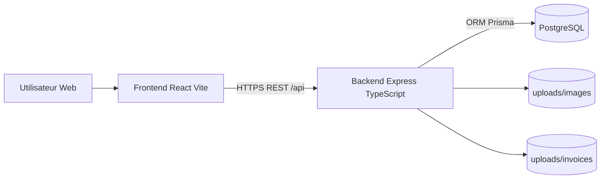
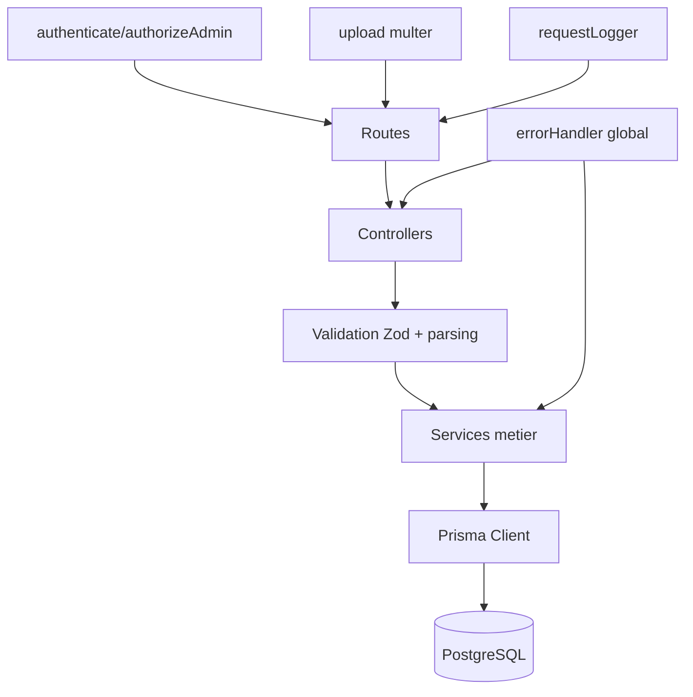
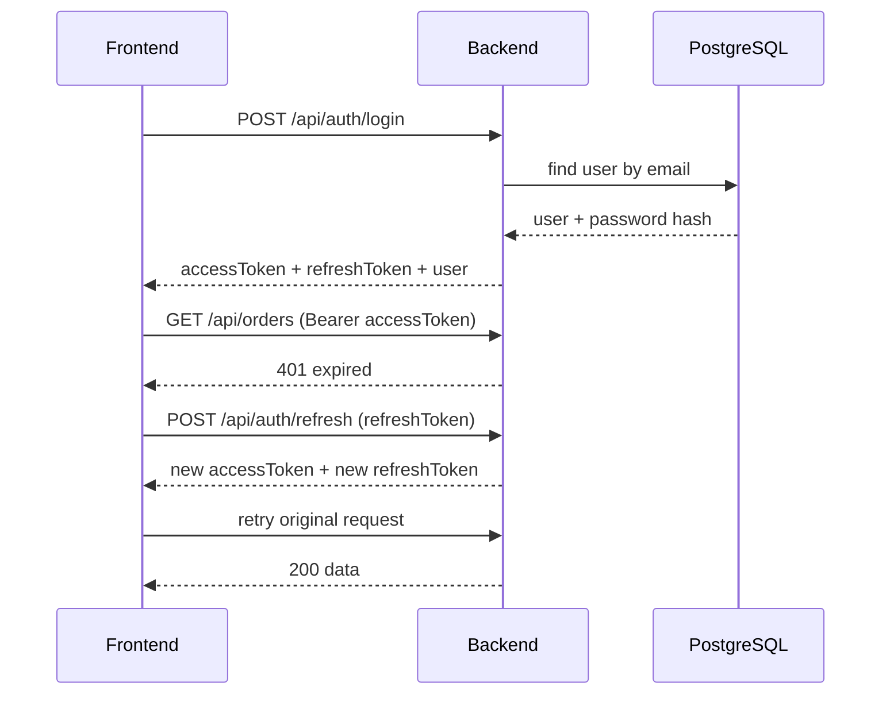
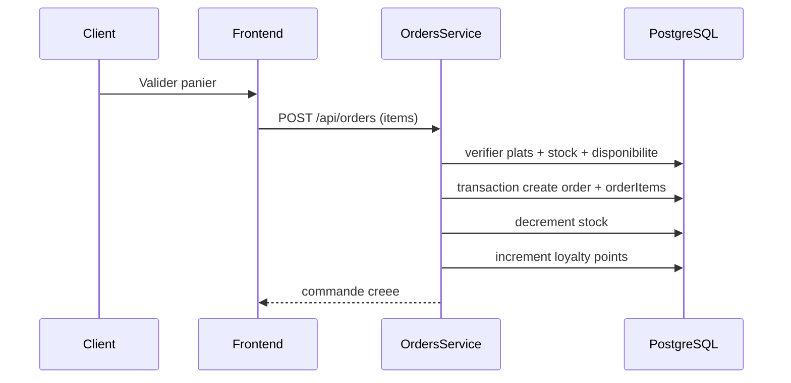
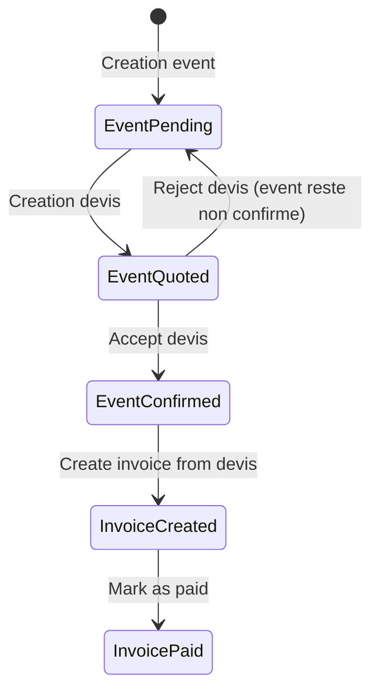
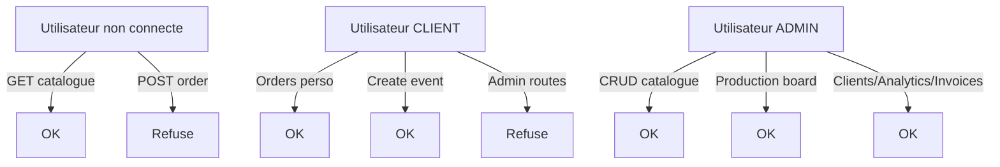

# Presentation Visuelle - Architecture Technique

## 1. Vue systeme globale

Lecture:
- Le frontend ne parle jamais directement a la base.
- Le backend centralise securite, logique metier et persistance.
- Les fichiers images et PDF sont stockes sur disque cote backend.

## 2. Architecture backend par couches

Lecture:
- Les routes definissent URL + middlewares.
- Les controllers transforment HTTP en donnees metier.
- Les services appliquent les regles business.
- Prisma encapsule les requetes SQL.

## 3. Flux authentification et refresh token

Lecture:
- Le refresh est pilote par interceptor Axios.
- Si refresh echoue, la session est nettoyee et redirection login.

## 4. Flux commande et stock

Lecture:
- Le total est recalcule serveur.
- Les updates critiques sont transactionnelles.

## 5. Flux event -> devis -> facture

Lecture:
- Le cycle commercial est explicite et traçable.
- Une facture peut venir d une commande classique ou d un devis evenementiel.

## 6. Matrice droits d acces

## 7. Amelioration typographique recommandee

Objectif:
- meilleure lisibilite sur paragraphes longs,
- identite visuelle plus premium,
- contraste clair entre titres et corps de texte.

Direction retenue:
- Titres: Cormorant Garamond (editorial haut de gamme).
- Texte courant: Manrope (moderne, lisible, numerique).

Regles pratiques:
- Taille de base body: 16px.
- Line-height body: 1.65.
- Line-height titres: 1.08 a 1.15.
- Letter spacing titres: leger negatif.
- Longueur ligne ideale: 60 a 80 caracteres pour texte dense.

## 8. Priorites d evolution architecture
1. Externaliser uploads vers S3 compatible (scalabilite multi-instance).
2. Basculer refresh token vers cookie httpOnly (securite XSS).
3. Ajouter OpenAPI pour contrat API standardise.
4. Ajouter tests integration sur flux critiques (orders/events/invoices).
